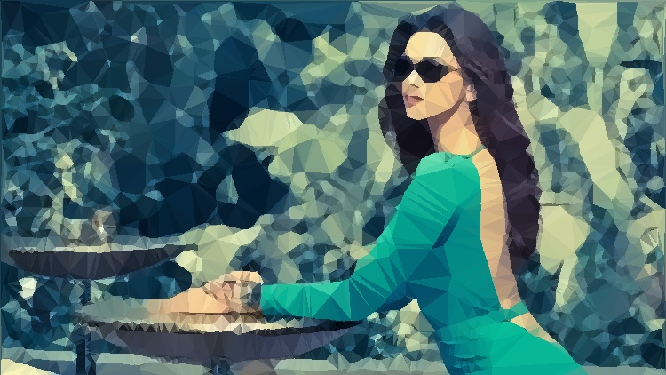
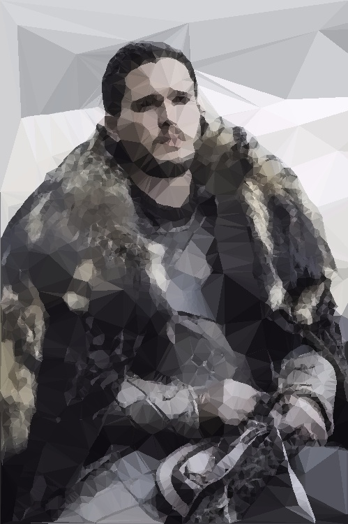
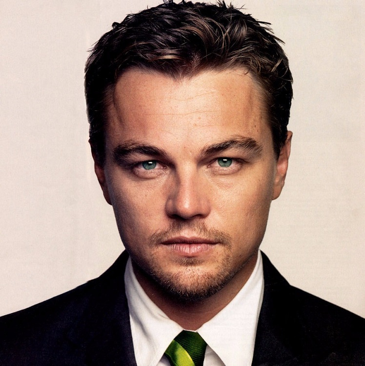
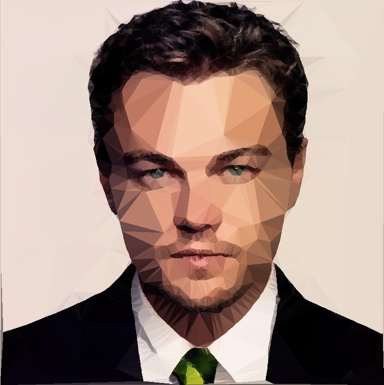
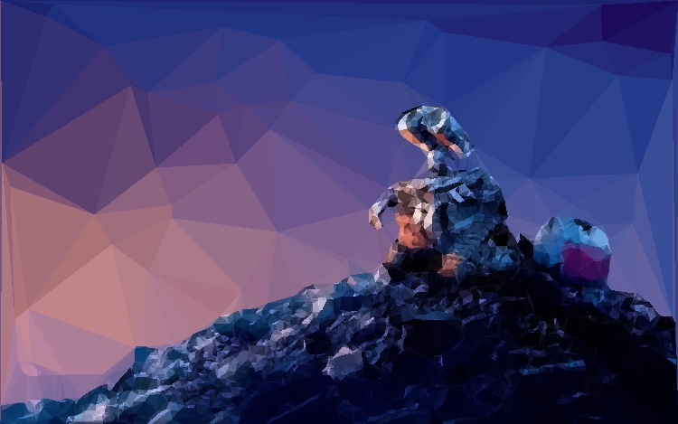
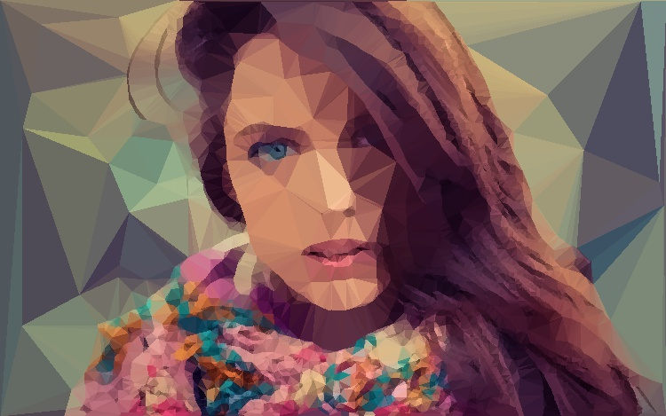
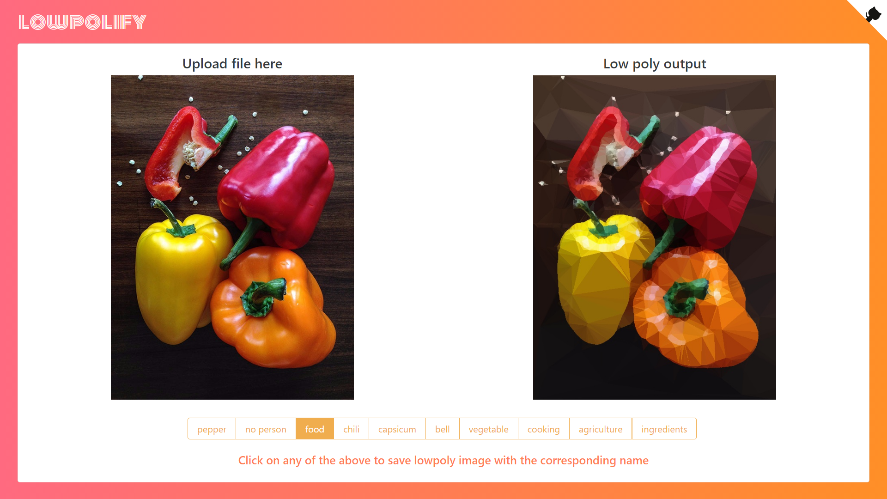

# lowpolify

<p align="center">
  

  

  

  
</p>

> “I’ve been waiting for you, Obi-Wan. We meet again, at last. The circle is now complete. When I left you, I was but the learner; now I am the master.” :sunglasses::sunglasses::sunglasses:


PS. Formal introductions are yet to begin, in case you were wondering. :sweat_smile:  

## Introduction
The goal of __lowpolify__ is quite simple. Generate low poly versions of any given image.

Now what is 'low poly' you may ask.

Here's what Wikipedia has for you: _Low poly is a polygon mesh in 3D computer graphics that has a relatively small number of polygons. Low poly meshes occur in real-time applications (e.g. games) and contrast with high poly meshes in animated movies and special effects of the same era. The term low poly is used in both a techni..._ **_yada yada yada_** you get the idea. Basically objects composed of only polygons. :information_desk_person::information_desk_person:  

If you'd like to skip all the chit chat, here's the **DEMO**. _Arr, matey, thar be ye booty!_  
https://lowpolify.ghostwriternr.me/

## Approach
Take an image, lowpolify it and **poof**!! :boom: LOW POLY, BABY!! :dancer::dancer:  

Here's an ELI5 TLDR :baby: :
- Pre-process the input image to remove noise and reduce image size
- Detect edges in the input image
- If the image contains humans faces, detect facial features as well
- Choose a random subset of the above detected points / edges
- Triangulate using Delaunay Triangulation
- Fill the triangles with the mean value of all pixels contained by it (in parallel for faster computation)
- LOW POLY, BABY! :dancer::dancer:  

## Sample output
Lo and Behold!

| High-poly input | Low-poly output |
| :---: |:---:|
|  |  |
|  |  |
|  |  |
|  |  |
|  |  |

## Screenshots
Now everybody loves to see the master at work, right? Right?? AMIRITE???  


## Dependencies
- Node.js
- Python3 (Along with the following python modules):
    + cv2
    + numpy
    + scipy
    + sharedmem
    + dlib

## How to use
- Clone the repo
```Shell
git clone https://github.com/ghostwriternr/lowpolify
```

- Navigate into the cloned repository
```Shell
cd lowpolify
```

- Install all `npm` modules
```Shell
npm install
```

- Create a file `secrets.json` under the `app/secrets/` directory. The structure of the file should look like this:
```json
{
  "apiKey": "xxxxxxxxxxxxxxxxxxxxxxxxxxxxxxxx"
}
```
You can create your own apiKey at your [Clarifai Developer account page](https://clarifai.com/developer/account/keys).

- Download and extract the .dat file from [dlib](http://dlib.net/files/shape_predictor_68_face_landmarks.dat.bz2) for facial features detection. Place the extracted file under `scripts` (the same directory as the `lowpolify.py` script).

- Start the server using `node`
```Shell
node server.js
```

- Marvel at the beauty served hot at http://localhost:8080/

## License
MIT :mortar_board:

## Psst
In case you too got bored reading this README, foxy here wants to give you a hugsy!  

<p>
  
</p>
