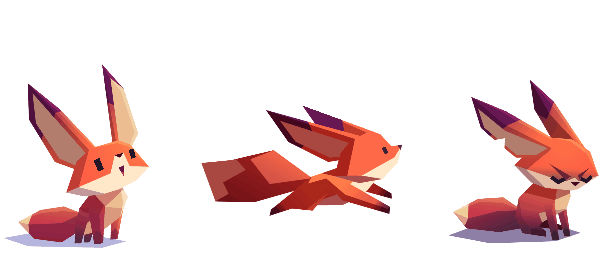

# lowpolify

> “I’ve been waiting for you, Obi-Wan. We meet again, at last. The circle is now complete. When I left you, I was but the learner; now I am the master.” :sunglasses::sunglasses::sunglasses:


PS. Formal introductions are yet to begin, in case you were wondering. :sweat_smile:  
PPS. The warrior above is also just a hoax to get you excited. Seriously, this ain't that good. :sweat_smile::sweat_smile:

## Introduction
The goal of __lowpolify__ is quite simple. Generate low poly versions of any given image.

Now what is 'low poly' you may ask.  
Guessed that. Haa! :grin:  

Here's what Wikipedia has for you: _Low poly is a polygon mesh in 3D computer graphics that has a relatively small number of polygons. Low poly meshes occur in real-time applications (e.g. games) and contrast with high poly meshes in animated movies and special effects of the same era. The term low poly is used in both a techni..._ **_yada yada yada_** you get the idea. :information_desk_person::information_desk_person:  

## Approach
Take an image, lowpolify it and **poof**!! :boom: LOW POLY, BABY!! :dancer::dancer:  

In subtler terms, here's a TLDR for nothing:
- Detect edges in the input image
- Choose a random subset of all points that belong to an edge
- Triangulate
- Fill the triangles with the mean value of all pixels contained by it.
- LOW POLY, BABY! :dancer::dancer:  

(That feels like an oversimplification, but ELI5 :baby: is the gold standard.)

## Sample output
Coming soon. (seriously)  
Till then, look at this adorable little fox, waiting for the sample output. Just like you! :sparkling_heart::sparkling_heart:  

<p>
  
</p>

## Dependencies
- Node.js
- Python3 (Along with the following python modules):
    + cv2
    + numpy
    + scipy

## How to use
- Clone the repo
```Shell
git clone https://github.com/ghostwriternr/lowpolify
```

- Navigate into the cloned repository
```Shell
cd lowpolify
```

- Install all `npm` modules
```Shell
npm install
```

- Start the server using `node`
```Shell
node server.js
```

- Marvel at the beauty.

## To-do
- [ ] Complete download implementation
- [ ] Add installation script
- [ ] Deploy to heroku
- [ ] Add sliders to customize output
- [ ] Use python multiprocessing to speed-up output
- [ ] Background subtraction for portraits

## But WHY :grey_question::grey_exclamation:
The professor might not be very interested in awarding me full scores for the **CS40019 Image Processing** term project, appreciating my mere physical presence. It's always safe to have a backup. **_wink wink_** :wink: **_nudge nudge_** :smirk:

## License
MIT :eyeglasses:
